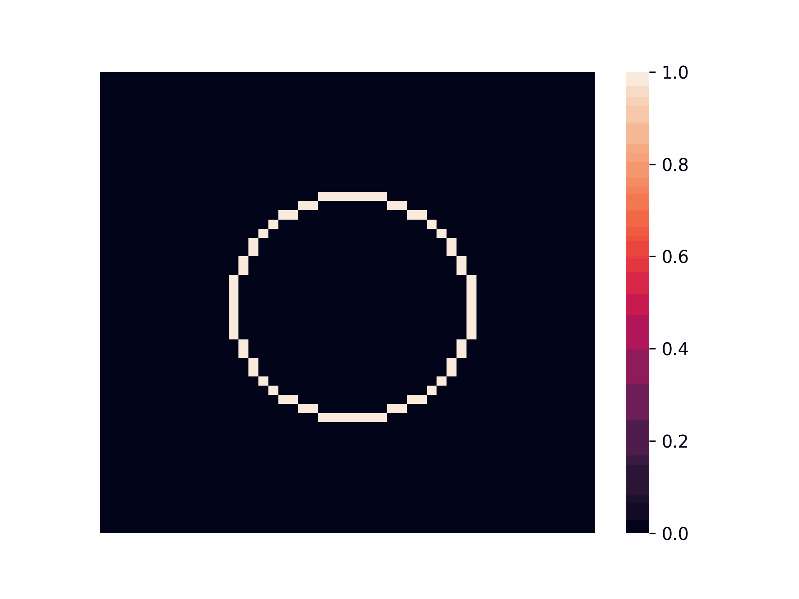

# Parallel Simulation of Contaminant Diffusion in Water

This project implements a numerical model to simulate the diffusion of contaminants in water bodies, using sequential and parallel methods to optimize performance. Based on the diffusion equation, it explores the efficiency of parallel approaches with OpenMP and provides a Python interface to facilitate usage in advanced analyses.

📄 **Full article can be accessed [here](./docs/).**

<p float="left">
    
    
</p>

## Build the Project
This project is built using CMake. You can install it using the following command:

```bash
sudo apt-get install cmake build-essential -y
```

To build the project, you can use the following commands on the project root directory:
```bash
# Generate configuration files. 
# Run this command only once or when you want to change the optimization flag
cmake -B build -S . [-DNO_OPTIMIZATION=ON/OFF]

# Run this command every time you want to compile the project
cmake --build build 
```

Otherwise, you can use the following shell script to build the project:
```bash
./build.sh [-h] [-e] [-v]
```
- `-h`: Show help message
- `-e`: Evaluation mode (print only the final time)
- `-v`: Verbose mode (show print messages)

Obs: if you are using __Windows__, use the `gcc` commands inside the script to compile the project.

This will create a `build` directory and generate three files in it:
- sequential (executable)
- omp (executable)
- cuda (executable)
- libDiffusionEquation.so (shared library)

The `sequential` executable is the sequential version of the diffusion equation solver, while the `omp` and `cuda` executables are the parallel versions using OpenMP and CUDA, respectively. The shared library `libDiffusionEquation.so` can be used to interface with the diffusion solver in Python.

The `NO_OPTIMIZATION` flag can be used to disable compiler optimizations. By default, the project is built with optimizations enabled. To disable optimizations, use `-DNO_OPTIMIZATION=ON`. **Note that the optimization process can vectorize the code so well that the parallelization does not provide any speedup**. In such cases, you can disable optimizations to see the effect of it.

## Using the C executable
The C executable provides a command-line interface for solving diffusion equations. The executable takes the following command-line arguments:

- `N`: Grid size
- `T`: Total iterations
- `D`: Diffusion coefficient
- `dt`: Time step
- `dx`: Spatial step
- `omp`: Number of OpenMP threads

```bash
./build/sequential <N> <T> <D> <dt> <dx>
./build/omp <N> <T> <D> <dt> <dx> <omp>
./build/cuda <N> <T> <D> <dt> <dx>
```

Here is an example of how to run the C executable:
```bash
time ./build/sequential 100 1000 0.1 0.01 1.0
time ./build/omp 100 1000 0.1 0.01 1.0 4
time ./build/cuda 100 1000 0.1 0.01 1.0
```

## Using the Python Module
The diffusion Python module provides an interface for solving diffusion equations using the shared C library compiled with the CMake. This allows for efficient numerical simulations by leveraging the computational speed of C while maintaining the flexibility and ease of use of Python.

This will be useful for users who are not familiar with C programming or who want to use the diffusion solver in a Python environment to create graphical visualizations or to integrate it with other Python libraries.

Before using the Python module, ensure that you have built the shared C library (libDiffusionEquation.so) as per the build instructions above.

To install the Python module, run the following command in the project root directory:
```bash
pip install -e .
```

The `-e` flag installs the module in editable mode, which means that any changes made to the source code will be reflected in the installed module without needing to reinstall it.

### Usage Example
Here is an example of how to use the diffusion Python module to solve a 2D diffusion equation:

```python
from diffusion import (
    SequentialDiffusionEquation,
    OMPdiffusionEquation,
    CUDADiffusionEquation,
)

lib_path = "./build/libDiffusionEquation.so"

# Context manager is not necessary for sequential and OMP
# solver, but it is recommended to use it even for them
with SequentialDiffusionEquation(
    library_path=lib_path, N=200, D=0.05, DELTA_T=0.02, DELTA_X=1.0,
    initial_concentration_points={(100, 100): 1.0},
) as seq_solver:

    for _ in range(1000): # Perform 1000 simulation steps
        diff_seq = seq_solver.step()  # Execute the C code step
    
    value_at_center = seq_solver.concentration_matrix[100][100]
    print(f"Sequential diffusion value at center: {value_at_center}")


with OMPdiffusionEquation(
    library_path=lib_path, N=200, D=0.05, DELTA_T=0.02, DELTA_X=1.0,
    initial_concentration_points={(100, 100): 1.0},
) as omp_solver:

    for _ in range(1000):
        diff_omp = omp_solver.step()  # Execute the OpenMP step
    
    value_at_center = omp_solver.concentration_matrix[100][100]
    print(f"OMP diffusion value at center: {value_at_center}")


# Context manager is necessary for CUDA solver
# You also can free them manually by calling the finalize method
with CUDADiffusionEquation(
    library_path=lib_path, N=200, D=0.05, DELTA_T=0.02, DELTA_X=1.0,
    initial_concentration_points={(100, 100): 1.0},
) as cuda_solver:

    for _ in range(1000):
        diff_cuda = cuda_solver.step()  # Execute the cuda step
    
    cuda_solver.get_result() # Get the result from the device to the host
    value_at_center = cuda_solver.concentration_matrix[100][100]
    print(f"CUDA diffusion value at center: {value_at_center}")

```
