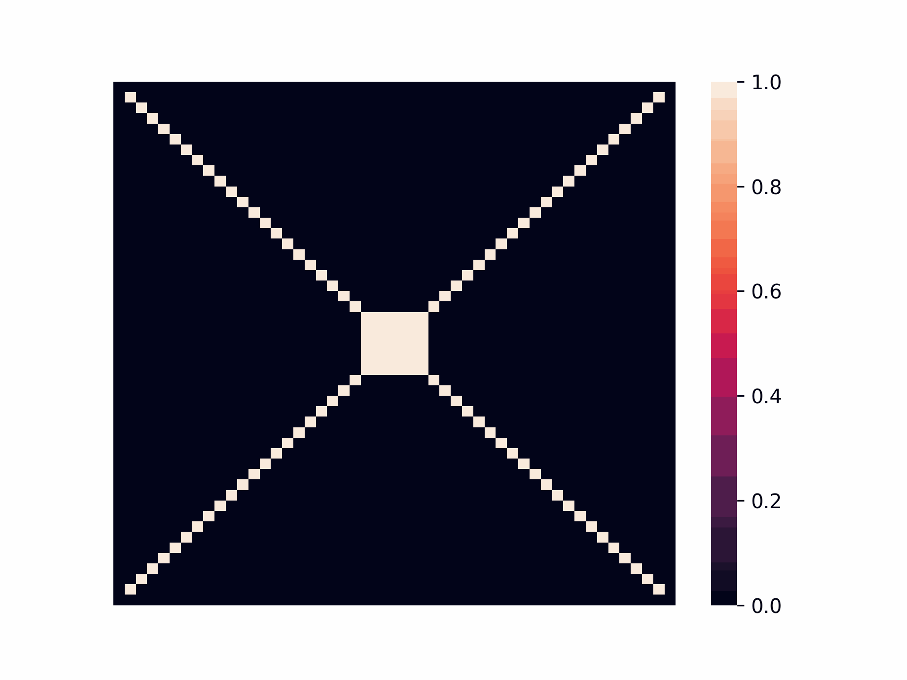

# Parallel Simulation of Contaminant Diffusion in Water

This project implements a numerical model to simulate the diffusion of contaminants in water bodies, using sequential and parallel methods to optimize performance. Based on the diffusion equation, it explores the efficiency of parallel approaches with OpenMP and provides a Python interface for advanced analyses.

📄 **Full article can be accessed [here](./docs/).**

<p float="left">
    
    
</p>

## Build the Project
This project is built using CMake. You can install the required tools using the following command:

```bash
sudo apt-get install cmake build-essential -y
```

To build the project, use the following commands in the project root directory:
```bash
# Generate configuration files. 
# Run this command only once or when you want to change the optimization flag
cmake -B build -S . [-DNO_OPTIMIZATION=ON] [-DENABLE_VERBOSE=ON] [-DENABLE_EVALUATE=ON]

# Run this command every time you want to compile the project
cmake --build build 
```

> [!CAUTION]
> The `NO_OPTIMIZATION` flag disables compiler optimizations. By default, the project is built with optimizations enabled, which can vectorize the code so well that the parallelization may not show significant speedup. Use this flag when you want to clearly see the benefits of parallel execution.

- `ENABLE_VERBOSE` enables a verbose compilation mode to display detailed information about the diffusion equation's steps.
- `ENABLE_EVALUATE` enables an evaluation mode that prints only the final simulation time.

> [!IMPORTANT]
> **Flag Conflict:** Do not use ENABLE_VERBOSE together with ENABLE_EVALUATE as it may lead to unexpected behavior.

Alternatively, you can use the provided shell script to build the project:
```bash
./build.sh [-h] [-e] [-v]
```
- `-h`: Show help message
- `-e`: Evaluation mode (print only the final time)
- `-v`: Verbose mode (show print messages)

> [!TIP]
> **Windows Users:** If you are using __Windows__, please use the `gcc` commands inside the script to compile the project.

This process will create a `build` directory containing:
- sequential (executable)
- omp (executable)
- cuda (executable)
- mpi (executable)
- libDiffusionEquation.so (shared library)

The `sequential` executable is the standard diffusion equation solver, while `omp`, `cuda` and `mpi` are parallel versions leveraging OpenMP, CUDA, and MPI, respectively. The shared library `libDiffusionEquation.so` allows interfacing with the diffusion solver from Python.

## Using the C Executable
The C executable offers a command-line interface to solve diffusion equations. The executable accepts the following arguments:

- `NEval`: Number times the simulation will be executed
- `N`: Grid size
- `T`: Total iterations
- `D`: Diffusion coefficient
- `dt`: Time step
- `dx`: Spatial step
- `omp`: Number of OpenMP threads
- `np`: Number of MPI processes

```bash
./build/sequential <NEval> <N> <T> <D> <dt> <dx>
./build/omp <NEval> <N> <T> <D> <dt> <dx> <omp>
./build/cuda <NEval> <N> <T> <D> <dt> <dx>
mpirun -np <np> --oversubscribe ./build/mpi <NEval> <N> <T> <D> <dt> <dx> <omp>
```

Here is an example of how to run the C executable:
```bash
time ./build/sequential 15 100 1000 0.1 0.01 1.0
time ./build/omp 15 100 1000 0.1 0.01 1.0 4
time ./build/cuda 15 100 1000 0.1 0.01 1.0
time mpirun -np 2 --oversubscribe ./build/mpi 15 100 1000 0.1 0.01 1.0 2
```

## Evaluation

To evaluate the performance of the parallel versions, use the scripts/run_simulations.sh script. This script runs the parallel executables with identical parameters and saves the execution times to a .txt file in the build/results directory.

Evaluation commands:
  ./build.sh -e  
  ./scripts/run_simulations.sh

### Evaluation with Python

In the `notebooks` directory, you’ll find a Jupyter notebook that evaluates the performance of the parallel versions using the Python module. The notebook employs the `time` module to measure execution times and `matplotlib` to plot the results. It also verifies the concentration matrix values between the parallel and sequential versions.

> [!WARNING]
> **MPI in Python:** The MPI version is not yet implemented in the Python module. Please use the shell script for MPI-based evaluations.

## Using the Python Module
The diffusion Python module offers an interface for solving diffusion equations via the shared C library compiled with CMake. This integration provides the speed of C with the flexibility of Python, making it ideal for users who prefer Python for graphical visualizations or integration with other libraries.

> [!IMPORTANT]
> **Pre-requisite:** Ensure you have built the shared C library (libDiffusionEquation.so) following the build instructions above.

To install the Python module in editable mode, run:
```bash
pip install -e .
```
> [!TIP]
> The `-e` flag ensures that any changes to the source code are immediately reflected without needing to reinstall the module.

### Usage Example
Below is an example that demonstrates solving a 2D diffusion equation using the Python module:

```python
from diffusion import (
    SequentialDiffusionEquation,
    OMPdiffusionEquation,
    CUDADiffusionEquation,
)

lib_path = "./build/libDiffusionEquation.so"

with SequentialDiffusionEquation(
    library_path=lib_path, N=200, D=0.05, DELTA_T=0.02, DELTA_X=1.0,
    initial_concentration_points={(100, 100): 1.0},
) as seq_solver:

    for _ in range(1000): # Perform 1000 simulation steps
        diff_seq = seq_solver.step()  # Execute the C code step
    
    value_at_center = seq_solver.concentration_matrix[100][100]
    print(f"Sequential diffusion value at center: {value_at_center}")


with OMPdiffusionEquation(
    library_path=lib_path, N=200, D=0.05, DELTA_T=0.02, DELTA_X=1.0,
    initial_concentration_points={(100, 100): 1.0},
) as omp_solver:

    for _ in range(1000):
        diff_omp = omp_solver.step()  # Execute the OpenMP step
    
    value_at_center = omp_solver.concentration_matrix[100][100]
    print(f"OMP diffusion value at center: {value_at_center}")

with CUDADiffusionEquation(
    library_path=lib_path, N=200, D=0.05, DELTA_T=0.02, DELTA_X=1.0,
    initial_concentration_points={(100, 100): 1.0},
) as cuda_solver:

    for _ in range(1000):
        diff_cuda = cuda_solver.step()  # Execute the cuda step
    
    cuda_solver.get_result() # Get the result from the device to the host
    value_at_center = cuda_solver.concentration_matrix[100][100]
    print(f"CUDA diffusion value at center: {value_at_center}")

```

> [!TIP]
> **Resource Management:** Using context managers (the `with` statement) ensures that all resources are properly freed after the simulation, especially for the CUDA solver.
